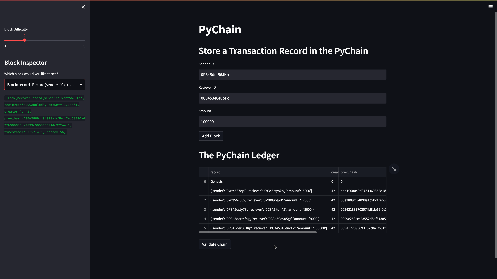
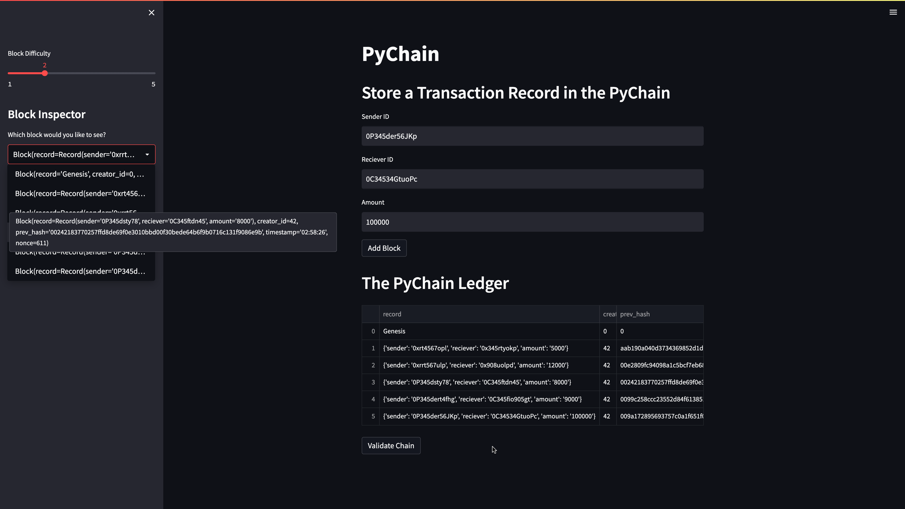
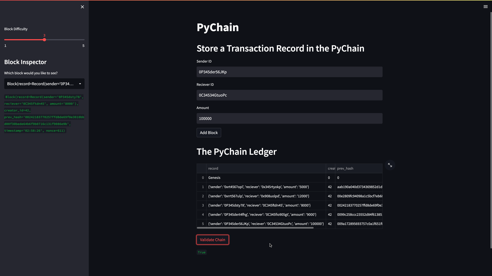
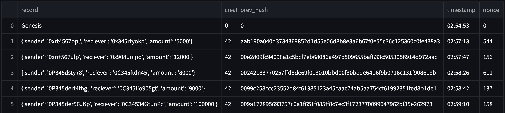

# Blockchain_Ledger
Blockchain, PyChain, Streamlit


(ImageSource: dreamstime.com)

#### Background:

In this project assuming the role of developer of a decentralized finance team in a bank, I am building a blockchain-based ledger system, completed with a user-friendly web interface.This ledger will allow partner banks to conduct financial transactions and to verify the integrity of the data in the ledger.

## Technologies
This project runs on python 3.7 and includes the following libraries and dependencies:

* streamlit 
* dataclasses 
* typing 
* Any, List
* datetime 
* pandas 
* hashlib

## Installation Guide

To use the application you need to install the following dependencies.

```
pip install streamlit

```

## Usage

To use this application just clone the repository and in the terminal navigate to the project folder, run the Streamlit application by using `streamlit run pychain.py`.

You can now view your Streamlit app in your browser.

In the app you can

* Enter values for the sender, receiver, and amount, and then click the "Add Block" button.
* Verify the block contents and hashes in the Streamlit drop-down menu.

## Usage Examples

### Blockchain consisting of several blocks


### Verification of the block contents and hashes


### Confirmation of the Blockchain validity


### Ledger Record


## Contributers

Manisha Lal

10/20/2022

manisha.lal.2009@gmail.com
___


## License
copyright 2022